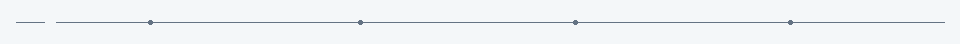
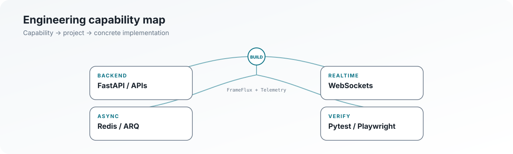
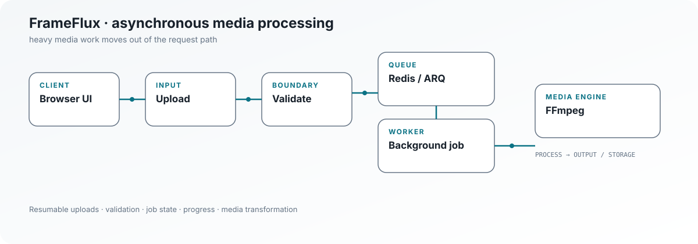
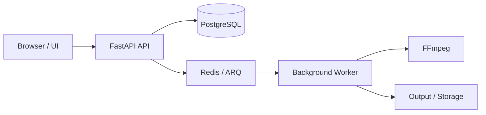
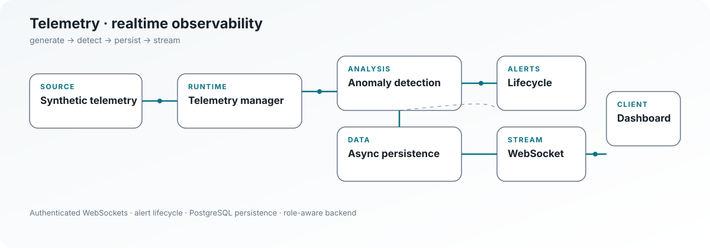
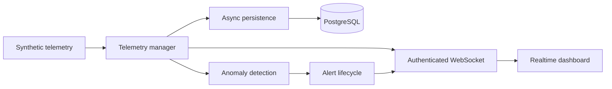

  <picture>
    <source media="(prefers-color-scheme: dark)" srcset="./assets/profile/hero-dark.svg">
    <source media="(prefers-color-scheme: light)" srcset="./assets/profile/hero-light.svg">
    
  </picture>

  <picture>
    <source media="(prefers-color-scheme: dark)" srcset="./assets/profile/signal-rail-dark.gif">
    <source media="(prefers-color-scheme: light)" srcset="./assets/profile/signal-rail-light.gif">
    
  </picture>

  <a href="https://github.com/faizansaiyed123/FrameFlux-Backend">FrameFlux</a>
  ·
  <a href="https://github.com/faizansaiyed123/telemetry-backend">Telemetry</a>
  ·
  <a href="https://faizansaiyed123.github.io/portfolio/">Portfolio</a>
  ·
  <a href="https://www.linkedin.com/in/faizan-saiyed-52b289228/">LinkedIn</a>

## What I build

I build complete web products with a strong focus on the engineering behind the interface: **backend APIs, realtime systems, asynchronous processing, data, security and verification.**

The two systems below are the center of this profile because they show those concerns in different ways.

<picture>
  <source media="(prefers-color-scheme: dark)" srcset="./assets/profile/capability-map-dark.svg">
  <source media="(prefers-color-scheme: light)" srcset="./assets/profile/capability-map-light.svg">
  
</picture>

<strong>Capability → evidence</strong>

### Backend & APIs
FastAPI services and explicit HTTP route boundaries are central to both FrameFlux and Telemetry.

### Realtime
Telemetry uses authenticated WebSockets for live telemetry, alert and system-event delivery.

### Async processing
FrameFlux uses Redis/ARQ background workers for media processing. Telemetry keeps PostgreSQL persistence behind bounded asynchronous processing.

### Data
PostgreSQL, SQLAlchemy and Alembic appear in the flagship backends. Redis is part of FrameFlux's processing architecture.

### Security
The flagship systems implement authentication/authorization boundaries; FrameFlux validates uploaded media inputs, while Telemetry uses JWT authentication, Argon2 password hashing and backend-enforced role checks.

### Verification
FrameFlux has backend tests covering authentication, authorization, validation/uploads, processing/editing, project APIs and status/jobs. Telemetry has unit and integration tests plus browser-level Playwright coverage in its frontend.

---

# FrameFlux

### Asynchronous media processing

[Backend repository](https://github.com/faizansaiyed123/FrameFlux-Backend) · [Frontend repository](https://github.com/faizansaiyed123/FrameFlux-Frontend)

A FastAPI media-processing system built around **PostgreSQL, Redis, ARQ background jobs and FFmpeg**, with a Next.js frontend.

<picture>
  <source media="(prefers-color-scheme: dark)" srcset="./assets/profile/frameflux-dark.svg">
  <source media="(prefers-color-scheme: light)" srcset="./assets/profile/frameflux-light.svg">
  
</picture>

**Interesting engineering surface**

- Long-running media work is modeled as background jobs rather than ordinary synchronous CRUD.
- Resumable uploads expose initialization, chunk transfer, pause/resume, retry, cancellation and finalization flows.
- Upload boundaries include extension, MIME/category, size and binary-signature validation.
- Media processing covers probing, conversion, editing, splitting, clip operations, overlays, transformations and freeze-frame workflows.
- PostgreSQL stores durable application metadata while Redis/ARQ coordinates asynchronous work and progress.

<strong>Inspect the implementation</strong>

**Architecture**

**Backend evidence**

[API composition](https://github.com/faizansaiyed123/FrameFlux-Backend/blob/main/app/main.py) ·
[Worker](https://github.com/faizansaiyed123/FrameFlux-Backend/blob/main/app/infrastructure/worker.py) ·
[Tasks](https://github.com/faizansaiyed123/FrameFlux-Backend/blob/main/app/infrastructure/tasks.py) ·
[Redis](https://github.com/faizansaiyed123/FrameFlux-Backend/blob/main/app/infrastructure/redis.py)

**Processing evidence**

[Media engine](https://github.com/faizansaiyed123/FrameFlux-Backend/blob/main/app/features/media/engine.py) ·
[Conversion](https://github.com/faizansaiyed123/FrameFlux-Backend/blob/main/app/features/media/conversion.py) ·
[Editing](https://github.com/faizansaiyed123/FrameFlux-Backend/blob/main/app/features/media/editing.py)

**Verification**

[Auth tests](https://github.com/faizansaiyed123/FrameFlux-Backend/blob/main/tests/test_auth.py) ·
[Authorization tests](https://github.com/faizansaiyed123/FrameFlux-Backend/blob/main/tests/test_authorization.py) ·
[Processing/editing tests](https://github.com/faizansaiyed123/FrameFlux-Backend/blob/main/tests/test_media_processing_and_editing.py) ·
[Upload/validation tests](https://github.com/faizansaiyed123/FrameFlux-Backend/blob/main/tests/test_validation_and_uploads.py)

---

# Telemetry

### Realtime infrastructure observability

[Backend repository](https://github.com/faizansaiyed123/telemetry-backend) · [Frontend repository](https://github.com/faizansaiyed123/telemetry-frontend)

A FastAPI observability system that generates **synthetic** telemetry, detects anomalies, manages alert state, persists history in PostgreSQL and streams live events over authenticated WebSockets.

<picture>
  <source media="(prefers-color-scheme: dark)" srcset="./assets/profile/telemetry-dark.svg">
  <source media="(prefers-color-scheme: light)" srcset="./assets/profile/telemetry-light.svg">
  
</picture>

**Interesting engineering surface**

- Correlated synthetic signals cover CPU, memory, temperature, network throughput, requests/sec, latency and error rate.
- Rolling z-score anomaly detection produces alert severity and lifecycle state.
- Telemetry generation and PostgreSQL persistence are separated by bounded asynchronous processing.
- Authentication uses JWTs and Argon2 password hashing, with backend-enforced viewer/operator/admin authorization.
- Simulation controls make realtime state and fault-injection behavior observable from the dashboard.
- The frontend contains browser-level E2E coverage for authentication, live streaming, alerts, analytics, hosts, administration, authorization, settings, logout protection and responsive navigation.

<strong>Inspect the implementation</strong>

**Architecture**

**Runtime evidence**

[Telemetry manager](https://github.com/faizansaiyed123/telemetry-backend/blob/main/app/services/telemetry_manager.py) ·
[Telemetry generator](https://github.com/faizansaiyed123/telemetry-backend/blob/main/app/services/telemetry_generator.py) ·
[Anomaly detector](https://github.com/faizansaiyed123/telemetry-backend/blob/main/app/services/anomaly_detector.py) ·
[WebSocket manager](https://github.com/faizansaiyed123/telemetry-backend/blob/main/app/services/websocket_manager.py) ·
[Telemetry persistence](https://github.com/faizansaiyed123/telemetry-backend/blob/main/app/services/telemetry_persistence.py)

**Security evidence**

[Security helpers](https://github.com/faizansaiyed123/telemetry-backend/blob/main/app/core/security.py) ·
[Authorization tests](https://github.com/faizansaiyed123/telemetry-backend/tree/main/tests/unit) ·
[Auth API tests](https://github.com/faizansaiyed123/telemetry-backend/blob/main/tests/integration/test_auth_api.py)

**Realtime/API verification**

[WebSocket integration tests](https://github.com/faizansaiyed123/telemetry-backend/blob/main/tests/integration/test_websocket.py) ·
[Telemetry API tests](https://github.com/faizansaiyed123/telemetry-backend/blob/main/tests/integration/test_telemetry_api.py) ·
[Simulation API tests](https://github.com/faizansaiyed123/telemetry-backend/blob/main/tests/integration/test_simulation_api.py)

**Browser journey**

[Full application E2E flow](https://github.com/faizansaiyed123/telemetry-frontend/blob/main/qa/e2e/test_full_application.py)

---

## How I engineer

### Separate the expensive work
Heavy processing belongs behind a job boundary. FrameFlux uses ARQ workers for FFmpeg work; Telemetry isolates database persistence from the generation path.

### Keep the backend authoritative
The frontend can expose role-aware controls, but protected operations remain backend responsibilities. Telemetry's authorization model is enforced by the API.

### Validate at the boundary
Inputs should be rejected before they reach expensive or security-sensitive processing. FrameFlux's upload pipeline reflects that principle directly.

### Verify behavior, not just code paths
Unit and integration tests cover backend behavior; the Telemetry frontend also exercises complete browser journeys against the application boundary.

## Core stack

**Backend**  
Python · FastAPI · PostgreSQL · SQLAlchemy · Alembic · Pydantic

**Systems**  
Redis · ARQ · WebSockets · FFmpeg · Uvicorn

**Frontend**  
React · Next.js · TypeScript · Vite · Tailwind CSS

**Engineering**  
Pytest · Playwright · Docker · GitHub Actions

## Engineering state

| Concern | Evidence |
|---|---|
| APIs | FastAPI services and feature-oriented route boundaries |
| Realtime | Authenticated WebSocket streaming in Telemetry |
| Async work | Redis/ARQ workers in FrameFlux; bounded persistence in Telemetry |
| Data | PostgreSQL + SQLAlchemy + Alembic |
| Security | JWT, Argon2, authorization checks, input validation |
| Verification | Unit, integration and browser-level E2E coverage |

## Current focus

**Realtime delivery · asynchronous processing · backend API design · authentication/authorization · testing confidence**

## Evidence map

For a deeper, fact-checked index of the profile's technical claims:

**[Open the engineering evidence map →](./docs/ENGINEERING.md)**

---

  Full-Stack Engineer · Backend & Systems

