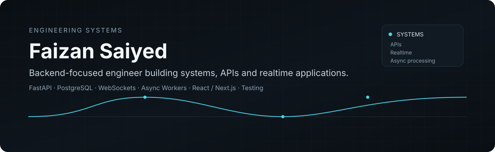
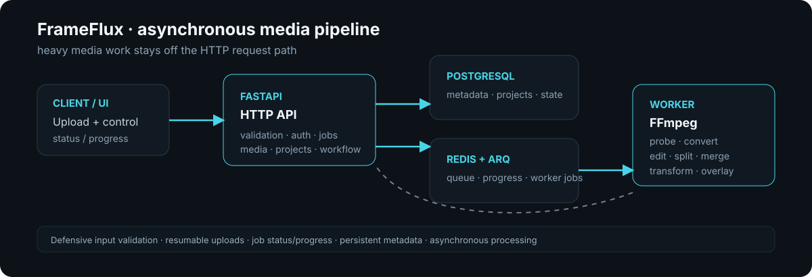
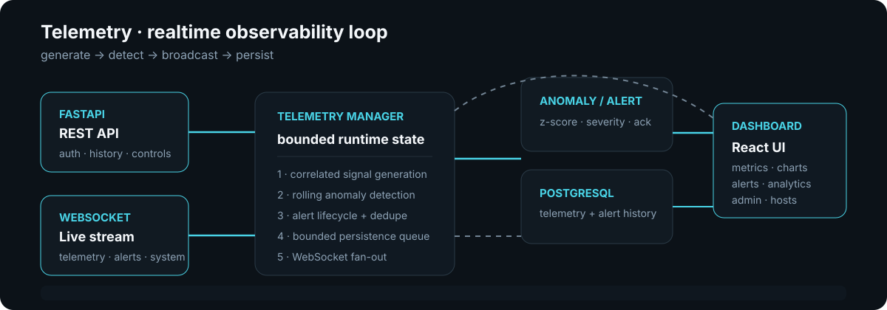
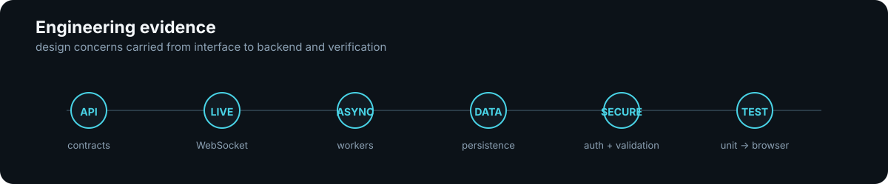

<!--
  Faizan Saiyed — GitHub profile
  Focus: backend systems, realtime applications, async processing, and engineering quality.
-->

  

  <a href="https://github.com/faizansaiyed123/FrameFlux-Backend">FrameFlux</a>
  &nbsp;·&nbsp;
  <a href="https://github.com/faizansaiyed123/telemetry-backend">Telemetry</a>
  &nbsp;·&nbsp;
  <a href="https://faizansaiyed123.github.io/portfolio/">Portfolio</a>
  &nbsp;·&nbsp;
  <a href="https://www.linkedin.com/in/faizan-saiyed-52b289228/">LinkedIn</a>

## What I build

I focus on backend-heavy products where the interesting work is behind the interface:

| Area | What that looks like in my work |
|---|---|
| **Backend systems** | FastAPI services, API boundaries, PostgreSQL, SQLAlchemy, migrations, authentication and authorization |
| **Realtime systems** | Authenticated WebSocket streams, live state, alert lifecycles, bounded client-side event buffers and reconnect handling |
| **Async processing** | Background workers, Redis/ARQ queues, FFmpeg workloads, job progress, resumable uploads and failure-aware processing |
| **Engineering quality** | Validation, defensive input handling, security checks, unit/integration testing and browser-level end-to-end verification |

## Selected systems

### FrameFlux — asynchronous media processing

**Backend:** [FrameFlux-Backend](https://github.com/faizansaiyed123/FrameFlux-Backend)  
**Frontend:** [FrameFlux-Frontend](https://github.com/faizansaiyed123/FrameFlux-Frontend)

A FastAPI media-processing platform built around PostgreSQL, Redis, ARQ background jobs and FFmpeg.

**Verified engineering surface**

- HTTP APIs for media, projects, jobs, previews, storage and workflow-oriented features
- Direct and resumable chunked uploads with pause/resume/retry/finalize flows
- Background processing through ARQ workers instead of keeping heavy FFmpeg work on the request path
- Media probing, conversion, editing, splitting, clip operations, overlays, transforms and freeze-frame processing
- Upload validation using extension allowlists, MIME/category checks, size limits and binary-signature inspection
- PostgreSQL persistence with async SQLAlchemy and Alembic
- Authentication plus security-focused route and validation tests

  

### Telemetry — realtime infrastructure observability

**Backend:** [telemetry-backend](https://github.com/faizansaiyed123/telemetry-backend)  
**Frontend:** [telemetry-frontend](https://github.com/faizansaiyed123/telemetry-frontend)

A real-time infrastructure observability platform that generates correlated synthetic telemetry, detects anomalies, manages alerts and streams live events to authenticated clients.

**Verified engineering surface**

- FastAPI REST API plus authenticated WebSocket streaming
- CPU, memory, temperature, network throughput, requests/sec, latency and error-rate signals
- Rolling z-score anomaly detection with alert severity and lifecycle state
- PostgreSQL persistence through SQLAlchemy + Alembic
- Bounded asynchronous persistence so database work stays off the main telemetry generation path
- JWT authentication, Argon2 password hashing and role-based access control
- Viewer/operator/admin capability boundaries enforced by the backend
- Simulation controls for start, pause, resume, reset, rate changes and controlled anomaly injection
- Browser E2E coverage spanning authentication, dashboard streaming, alerts, analytics, hosts, administration, settings, logout guards, mobile navigation and authorization checks

  

## Engineering evidence

The projects above are useful because they show the same engineering concerns at different system boundaries.

### Architecture decisions I care about

- **Keep expensive work off synchronous request paths.** FrameFlux pushes media processing into ARQ workers; Telemetry keeps PostgreSQL persistence behind a bounded queue.
- **Make the backend the authority.** Telemetry's UI exposes role-aware behavior, but authorization, JWT validation and user status checks remain backend responsibilities.
- **Treat inputs as hostile until validated.** FrameFlux validates filenames, extensions, MIME categories, file sizes and executable/script signatures before processing.
- **Design for observable state.** FrameFlux exposes job/status/progress concepts; Telemetry exposes live sequence/state, alerts, historical data and aggregate statistics.
- **Verify the user journey, not only the function.** The Telemetry frontend contains a browser-level journey that exercises public entry, authentication, realtime behavior, CRUD, roles, cross-session deactivation, settings and responsive navigation.

## Supporting work

These repositories add breadth without competing with the two primary systems.

- [gemini-backend-clone](https://github.com/faizansaiyed123/gemini-backend-clone) — FastAPI AI-chat backend with JWT/OTP flows, chatrooms, Redis-backed asynchronous processing, rate limiting and Stripe subscription handling.
- [Focus-Journal-Backend](https://github.com/faizansaiyed123/Focus-Journal-Backend) — FastAPI/PostgreSQL backend for journaling, goals, check-ins, analytics and authentication.
- [Focus-Journal-Frontend](https://github.com/faizansaiyed123/Focus-Journal-Frontend) — React/Vite/Tailwind frontend with analytics, journal, goals, check-ins and application state management.
- [Sayphora](https://github.com/faizansaiyed123/Sayphora) — Next.js/TypeScript application using Better Auth, Drizzle and Neon/PostgreSQL.

## Technical stack

**Core backend**  
Python · FastAPI · PostgreSQL · SQLAlchemy · Alembic · Pydantic

**Systems & async**  
Redis · ARQ · WebSockets · FFmpeg · Uvicorn

**Frontend**  
React · Next.js · TypeScript · JavaScript · Vite · Tailwind CSS

**Testing & delivery**  
Pytest · Playwright · Docker · GitHub Actions

**Additional experience**  
Django · Flask · OAuth · OpenAI API · Stripe

## Current focus

Building deeper systems experience around:

**realtime delivery · asynchronous processing · production-oriented API design · authentication/authorization · testing confidence**

## Engineering map

I keep the profile intentionally selective. Public learning repositories, forks and small experiments remain part of the GitHub history, but the profile foregrounds original systems that best demonstrate how I design, build and verify software.

[Open the engineering evidence map →](./docs/ENGINEERING.md)

---

  Backend-first engineer · systems, APIs, realtime applications and reliable async workflows

